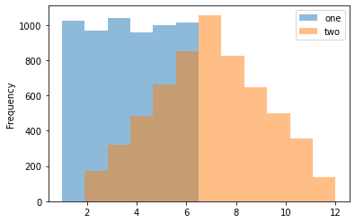

```python
import pandas as pd
```


```python
! pwd
```

    /home/william/Documents/github_dir/Personal_blog/test_nb


```python
pd.read_csv('/home/william/Documents/github_dir/Personal_blog/test_nb/Future50.csv')
```


<div>
<style scoped>
    .dataframe tbody tr th:only-of-type {
        vertical-align: middle;
    }

    .dataframe tbody tr th {
        vertical-align: top;
    }

    .dataframe thead th {
        text-align: right;
    }
</style>
<table border="1" class="dataframe">
  <thead>
    <tr style="text-align: right;">
      <th></th>
      <th>Rank</th>
      <th>Restaurant</th>
      <th>Location</th>
      <th>Sales</th>
      <th>YOY_Sales</th>
      <th>Units</th>
      <th>YOY_Units</th>
      <th>Unit_Volume</th>
      <th>Franchising</th>
    </tr>
  </thead>
  <tbody>
    <tr>
      <th>0</th>
      <td>1</td>
      <td>Evergreens</td>
      <td>Seattle, Wash.</td>
      <td>24</td>
      <td>130.5%</td>
      <td>26</td>
      <td>116.7%</td>
      <td>1150</td>
      <td>No</td>
    </tr>
    <tr>
      <th>1</th>
      <td>2</td>
      <td>Clean Juice</td>
      <td>Charlotte, N.C.</td>
      <td>44</td>
      <td>121.9%</td>
      <td>105</td>
      <td>94.4%</td>
      <td>560</td>
      <td>Yes</td>
    </tr>
    <tr>
      <th>2</th>
      <td>3</td>
      <td>Slapfish</td>
      <td>Huntington Beach, Calif.</td>
      <td>21</td>
      <td>81.0%</td>
      <td>21</td>
      <td>90.9%</td>
      <td>1370</td>
      <td>Yes</td>
    </tr>
    <tr>
      <th>3</th>
      <td>4</td>
      <td>Clean Eatz</td>
      <td>Wilmington, N.C.</td>
      <td>25</td>
      <td>79.7%</td>
      <td>46</td>
      <td>58.6%</td>
      <td>685</td>
      <td>Yes</td>
    </tr>
    <tr>
      <th>4</th>
      <td>5</td>
      <td>Pokeworks</td>
      <td>Irvine, Calif.</td>
      <td>49</td>
      <td>77.1%</td>
      <td>50</td>
      <td>56.3%</td>
      <td>1210</td>
      <td>Yes</td>
    </tr>
    <tr>
      <th>5</th>
      <td>6</td>
      <td>Playa Bowls</td>
      <td>Belmar,  N.J.</td>
      <td>39</td>
      <td>62.9%</td>
      <td>76</td>
      <td>28.8%</td>
      <td>580</td>
      <td>Yes</td>
    </tr>
    <tr>
      <th>6</th>
      <td>7</td>
      <td>The Simple Greek</td>
      <td>Blue Bell, Pa.</td>
      <td>24</td>
      <td>52.5%</td>
      <td>36</td>
      <td>33.3%</td>
      <td>775</td>
      <td>Yes</td>
    </tr>
    <tr>
      <th>7</th>
      <td>8</td>
      <td>Melt Shop</td>
      <td>New York, N.Y.</td>
      <td>20</td>
      <td>39.6%</td>
      <td>19</td>
      <td>35.7%</td>
      <td>1260</td>
      <td>Yes</td>
    </tr>
    <tr>
      <th>8</th>
      <td>9</td>
      <td>Creamistry</td>
      <td>Yorba Linda,  Calif.</td>
      <td>24</td>
      <td>36.8%</td>
      <td>60</td>
      <td>27.7%</td>
      <td>465</td>
      <td>Yes</td>
    </tr>
    <tr>
      <th>9</th>
      <td>10</td>
      <td>Joella's Hot Chicken</td>
      <td>Louisville, Ky.</td>
      <td>29</td>
      <td>35.5%</td>
      <td>17</td>
      <td>30.8%</td>
      <td>1930</td>
      <td>No</td>
    </tr>
    <tr>
      <th>10</th>
      <td>11</td>
      <td>Eggs Up Grill</td>
      <td>Spartanburg, S.C.</td>
      <td>30</td>
      <td>35.4%</td>
      <td>41</td>
      <td>36.7%</td>
      <td>860</td>
      <td>Yes</td>
    </tr>
    <tr>
      <th>11</th>
      <td>12</td>
      <td>Dog Haus</td>
      <td>Pasadena, Calif.</td>
      <td>39</td>
      <td>34.5%</td>
      <td>50</td>
      <td>42.9%</td>
      <td>1200</td>
      <td>Yes</td>
    </tr>
    <tr>
      <th>12</th>
      <td>13</td>
      <td>Teriyaki Madness</td>
      <td>Denver, Colo.</td>
      <td>41</td>
      <td>34.1%</td>
      <td>63</td>
      <td>65.8%</td>
      <td>890</td>
      <td>Yes</td>
    </tr>
    <tr>
      <th>13</th>
      <td>14</td>
      <td>Bluestone Lane</td>
      <td>New York, N.Y.</td>
      <td>48</td>
      <td>33.0%</td>
      <td>48</td>
      <td>37.1%</td>
      <td>1175</td>
      <td>No</td>
    </tr>
    <tr>
      <th>14</th>
      <td>15</td>
      <td>Original ChopShop</td>
      <td>Plano, Texas</td>
      <td>21</td>
      <td>32.5%</td>
      <td>12</td>
      <td>20.0%</td>
      <td>1930</td>
      <td>No</td>
    </tr>
    <tr>
      <th>15</th>
      <td>16</td>
      <td>Rapid Fired Pizza</td>
      <td>Kettering, Ohio</td>
      <td>24</td>
      <td>32.2%</td>
      <td>35</td>
      <td>29.6%</td>
      <td>780</td>
      <td>Yes</td>
    </tr>
    <tr>
      <th>16</th>
      <td>17</td>
      <td>Ike's Love &amp; Sandwiches</td>
      <td>San Francisco, Calif.</td>
      <td>44</td>
      <td>30.8%</td>
      <td>71</td>
      <td>29.1%</td>
      <td>700</td>
      <td>Yes</td>
    </tr>
    <tr>
      <th>17</th>
      <td>18</td>
      <td>Vitality Bowls</td>
      <td>San Ramon, Calif.</td>
      <td>37</td>
      <td>30.1%</td>
      <td>77</td>
      <td>24.2%</td>
      <td>535</td>
      <td>Yes</td>
    </tr>
    <tr>
      <th>18</th>
      <td>19</td>
      <td>Hawkers Asian Street Fare</td>
      <td>Orlando, Fla.</td>
      <td>22</td>
      <td>30.0%</td>
      <td>7</td>
      <td>40.0%</td>
      <td>3800</td>
      <td>No</td>
    </tr>
    <tr>
      <th>19</th>
      <td>20</td>
      <td>Maple Street Biscuit Co.</td>
      <td>Orange Park, Fla.</td>
      <td>39</td>
      <td>28.9%</td>
      <td>33</td>
      <td>10.0%</td>
      <td>1260</td>
      <td>Yes</td>
    </tr>
    <tr>
      <th>20</th>
      <td>21</td>
      <td>Bulla Gastrobar</td>
      <td>Doral, Fla.</td>
      <td>32</td>
      <td>28.2%</td>
      <td>8</td>
      <td>14.3%</td>
      <td>4300</td>
      <td>No</td>
    </tr>
    <tr>
      <th>21</th>
      <td>22</td>
      <td>Duck Donuts</td>
      <td>Mechanicsburg, Pa.</td>
      <td>44</td>
      <td>28.0%</td>
      <td>90</td>
      <td>16.9%</td>
      <td>530</td>
      <td>Yes</td>
    </tr>
    <tr>
      <th>22</th>
      <td>23</td>
      <td>The Little Beet</td>
      <td>New York, N.Y.</td>
      <td>23</td>
      <td>26.5%</td>
      <td>12</td>
      <td>33.3%</td>
      <td>2230</td>
      <td>No</td>
    </tr>
    <tr>
      <th>23</th>
      <td>24</td>
      <td>Joe &amp; The Juice</td>
      <td>New York, N.Y.</td>
      <td>47</td>
      <td>25.9%</td>
      <td>69</td>
      <td>25.5%</td>
      <td>760</td>
      <td>Yes</td>
    </tr>
    <tr>
      <th>24</th>
      <td>25</td>
      <td>By Chloe</td>
      <td>New York, N.Y.</td>
      <td>37</td>
      <td>25.6%</td>
      <td>14</td>
      <td>7.7%</td>
      <td>2800</td>
      <td>No</td>
    </tr>
    <tr>
      <th>25</th>
      <td>26</td>
      <td>Sugarfire Smokehouse</td>
      <td>Olivette, Mo.</td>
      <td>39</td>
      <td>25.4%</td>
      <td>15</td>
      <td>15.4%</td>
      <td>2820</td>
      <td>No</td>
    </tr>
    <tr>
      <th>26</th>
      <td>27</td>
      <td>Bibibop Asian Grill</td>
      <td>Columbus, Ohio</td>
      <td>44</td>
      <td>24.6%</td>
      <td>37</td>
      <td>23.3%</td>
      <td>1330</td>
      <td>No</td>
    </tr>
    <tr>
      <th>27</th>
      <td>28</td>
      <td>Bubbakoo's Burritos</td>
      <td>Wall Township, N.J.</td>
      <td>28</td>
      <td>24.3%</td>
      <td>31</td>
      <td>14.8%</td>
      <td>970</td>
      <td>Yes</td>
    </tr>
    <tr>
      <th>28</th>
      <td>29</td>
      <td>Dos Toros Taqueria</td>
      <td>New York, N.Y.</td>
      <td>28</td>
      <td>24.0%</td>
      <td>22</td>
      <td>10.0%</td>
      <td>1375</td>
      <td>No</td>
    </tr>
    <tr>
      <th>29</th>
      <td>30</td>
      <td>The Pizza Press</td>
      <td>Anaheim, Calif.</td>
      <td>27</td>
      <td>23.7%</td>
      <td>27</td>
      <td>22.7%</td>
      <td>1130</td>
      <td>Yes</td>
    </tr>
    <tr>
      <th>30</th>
      <td>31</td>
      <td>The Lost Cajun</td>
      <td>Frisco, Texas</td>
      <td>20</td>
      <td>23.0%</td>
      <td>26</td>
      <td>4.0%</td>
      <td>785</td>
      <td>Yes</td>
    </tr>
    <tr>
      <th>31</th>
      <td>32</td>
      <td>Just Salad</td>
      <td>New York, N.Y.</td>
      <td>42</td>
      <td>22.7%</td>
      <td>38</td>
      <td>26.7%</td>
      <td>1240</td>
      <td>No</td>
    </tr>
    <tr>
      <th>32</th>
      <td>33</td>
      <td>Jeni's Splendid Ice Creams</td>
      <td>Columbus, Ohio</td>
      <td>42</td>
      <td>22.4%</td>
      <td>44</td>
      <td>22.2%</td>
      <td>1050</td>
      <td>No</td>
    </tr>
    <tr>
      <th>33</th>
      <td>34</td>
      <td>Boqueria</td>
      <td>New York, N.Y.</td>
      <td>27</td>
      <td>22.0%</td>
      <td>7</td>
      <td>16.7%</td>
      <td>4260</td>
      <td>No</td>
    </tr>
    <tr>
      <th>34</th>
      <td>35</td>
      <td>Quickway Japanese Hibachi</td>
      <td>Fairfax, Va.</td>
      <td>22</td>
      <td>21.4%</td>
      <td>25</td>
      <td>19.0%</td>
      <td>985</td>
      <td>Yes</td>
    </tr>
    <tr>
      <th>35</th>
      <td>36</td>
      <td>Surcheros</td>
      <td>Douglas, Ga.</td>
      <td>22</td>
      <td>21.3%</td>
      <td>20</td>
      <td>17.6%</td>
      <td>1230</td>
      <td>Yes</td>
    </tr>
    <tr>
      <th>36</th>
      <td>37</td>
      <td>Famous Toastery</td>
      <td>Charlotte, N.C.</td>
      <td>40</td>
      <td>21.2%</td>
      <td>27</td>
      <td>8.0%</td>
      <td>1540</td>
      <td>Yes</td>
    </tr>
    <tr>
      <th>37</th>
      <td>38</td>
      <td>Culinary Dropout</td>
      <td>Scottsdale, Ariz.</td>
      <td>20</td>
      <td>20.8%</td>
      <td>7</td>
      <td>16.7%</td>
      <td>3120</td>
      <td>No</td>
    </tr>
    <tr>
      <th>38</th>
      <td>39</td>
      <td>Condado Tacos</td>
      <td>Columbus, Ohio</td>
      <td>38</td>
      <td>19.9%</td>
      <td>15</td>
      <td>15.4%</td>
      <td>2755</td>
      <td>No</td>
    </tr>
    <tr>
      <th>39</th>
      <td>40</td>
      <td>The Flying Biscuit Cafe</td>
      <td>Atlanta, Ga.</td>
      <td>29</td>
      <td>19.5%</td>
      <td>21</td>
      <td>16.7%</td>
      <td>1510</td>
      <td>Yes</td>
    </tr>
    <tr>
      <th>40</th>
      <td>41</td>
      <td>Blue Sushi Sake Grill</td>
      <td>Omaha, Neb.</td>
      <td>49</td>
      <td>19.5%</td>
      <td>14</td>
      <td>16.7%</td>
      <td>3500</td>
      <td>No</td>
    </tr>
    <tr>
      <th>41</th>
      <td>42</td>
      <td>The Human Bean</td>
      <td>Medford, Ore.</td>
      <td>47</td>
      <td>19.0%</td>
      <td>97</td>
      <td>19.8%</td>
      <td>535</td>
      <td>Yes</td>
    </tr>
    <tr>
      <th>42</th>
      <td>43</td>
      <td>Spitz Mediterranean Street Food</td>
      <td>Los Angeles, Calif.</td>
      <td>28</td>
      <td>18.8%</td>
      <td>11</td>
      <td>10.0%</td>
      <td>2700</td>
      <td>No</td>
    </tr>
    <tr>
      <th>43</th>
      <td>44</td>
      <td>Tacos 4 Life</td>
      <td>Conway, Ark.</td>
      <td>25</td>
      <td>18.4%</td>
      <td>16</td>
      <td>6.7%</td>
      <td>1620</td>
      <td>Yes</td>
    </tr>
    <tr>
      <th>44</th>
      <td>45</td>
      <td>Pita Mediterranean Street Food</td>
      <td>Fairburn, Ga.</td>
      <td>38</td>
      <td>17.8%</td>
      <td>32</td>
      <td>10.3%</td>
      <td>1260</td>
      <td>Yes</td>
    </tr>
    <tr>
      <th>45</th>
      <td>46</td>
      <td>LA Crawfish</td>
      <td>McAllen, Texas</td>
      <td>48</td>
      <td>17.6%</td>
      <td>25</td>
      <td>13.6%</td>
      <td>2050</td>
      <td>Yes</td>
    </tr>
    <tr>
      <th>46</th>
      <td>47</td>
      <td>&amp;pizza</td>
      <td>Washington, D.C.</td>
      <td>45</td>
      <td>17.1%</td>
      <td>35</td>
      <td>9.4%</td>
      <td>1350</td>
      <td>No</td>
    </tr>
    <tr>
      <th>47</th>
      <td>48</td>
      <td>Super Duper Burgers</td>
      <td>San Francisco, Calif.</td>
      <td>39</td>
      <td>16.9%</td>
      <td>16</td>
      <td>14.3%</td>
      <td>2630</td>
      <td>No</td>
    </tr>
    <tr>
      <th>48</th>
      <td>49</td>
      <td>StoneFire Grill</td>
      <td>Agoura Hills, Calif.</td>
      <td>31</td>
      <td>16.0%</td>
      <td>13</td>
      <td>8.3%</td>
      <td>2550</td>
      <td>No</td>
    </tr>
    <tr>
      <th>49</th>
      <td>50</td>
      <td>Gus's World Famous Fried Chicken</td>
      <td>Memphis, Tenn.</td>
      <td>44</td>
      <td>14.4%</td>
      <td>28</td>
      <td>7.7%</td>
      <td>1600</td>
      <td>Yes</td>
    </tr>
  </tbody>
</table>
</div>


```python
import numpy as np
df = pd.DataFrame(
    np.random.randint(1, 7, 6000),
    columns = ['one'])
df['two'] = df['one'] + np.random.randint(1, 7, 6000)
ax = df.plot.hist(bins=12, alpha=0.5)
```


    

    


```python

```
